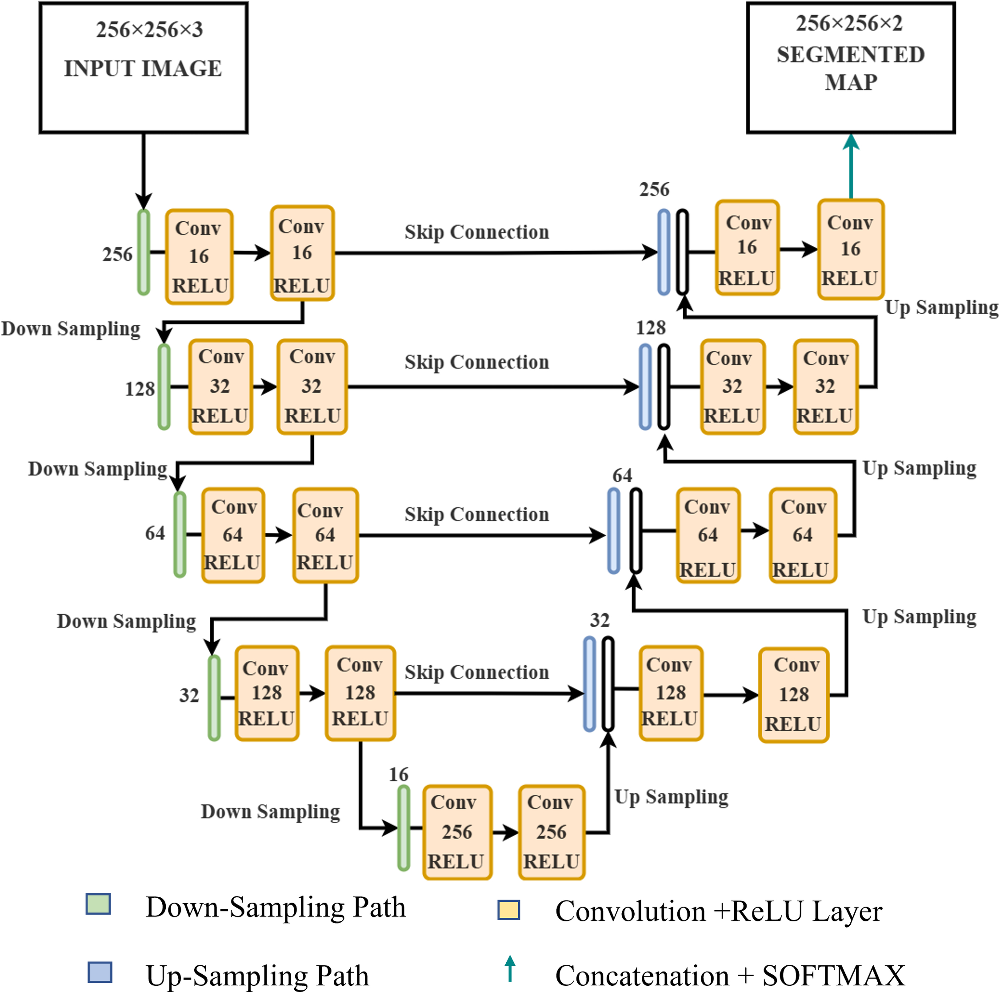
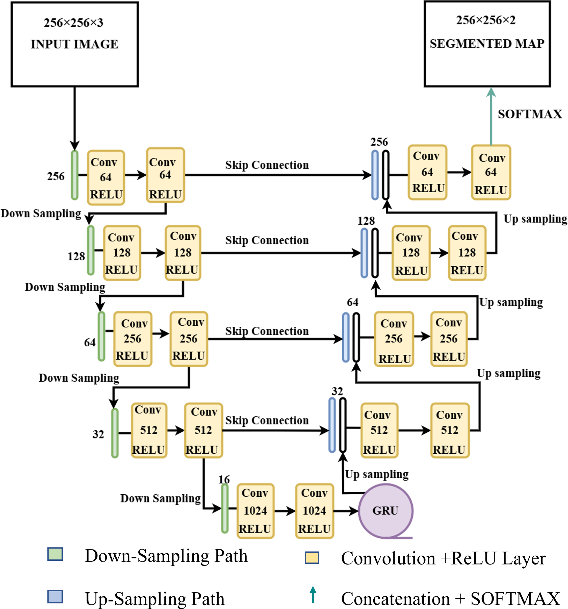
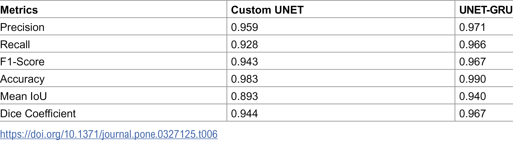
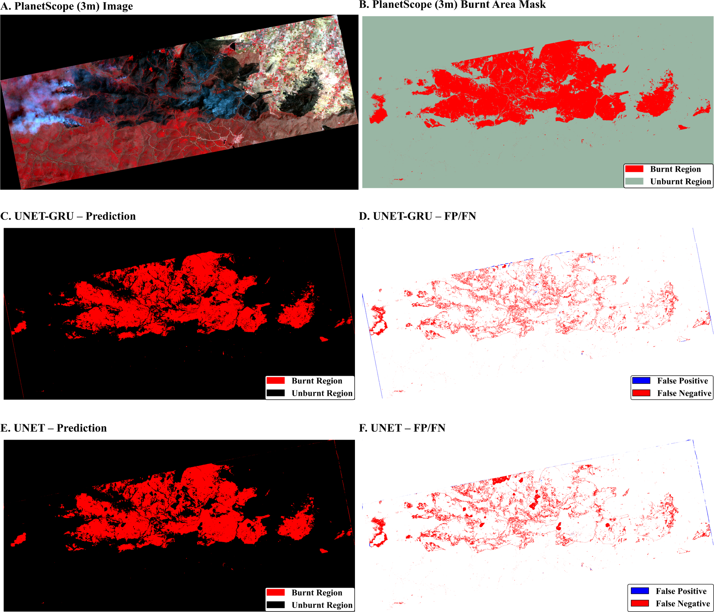

# Burnt Area Mapping Using Satellite Imagery Semantic Segmentation Research

[](https://opensource.org/licenses/MIT)
[](https://www.python.org/downloads/)
[](https://github.com/bsvskashyap/satellite-burnt-area-segmentation)

## 📓 Notebooks

- [View Pre_Process.ipynb on GitHub](https://github.com/bsvskashyap/satellite-burnt-area-segmentation/blob/main/notebooks/Pre_Process.ipynb) - Data preprocessing pipeline
- [View Train.ipynb on GitHub](https://github.com/bsvskashyap/satellite-burnt-area-segmentation/blob/main/notebooks/Train.ipynb) - Model training with custom architectures
- [View Final.ipynb on GitHub](https://github.com/bsvskashyap/satellite-burnt-area-segmentation/blob/main/notebooks/Final.ipynb) - Inference and visualization

---

This repository contains the implementation and trained models for semantic segmentation of satellite imagery using deep learning techniques. The project focuses on developing robust neural network architectures for pixel-wise classification of satellite imagery for burnt area mapping.

## 🏆 Key Achievements

- **📄 Published Research**: Two peer-reviewed publications demonstrating novel deep learning architectures and cross-resolution transfer learning approaches:
  - **PLOS ONE (2025)**: "Deep Learning Architectures for Burnt Area Mapping from Satellite Imagery" - Introduced Custom UNET and UNET-GRU architectures achieving state-of-the-art performance (AUC: 0.96-0.98) for burnt area segmentation.
  - **Sensors (2025)**: "Cross-Resolution Transfer Learning for Burnt Area Mapping Using Landsat and PlanetScope Imagery" - Demonstrated robust model transferability across satellite resolutions (3m-30m) with strong generalization capabilities.
- **🧠 Novel Architectures**: Developed two novel deep learning architectures:
  - **Custom UNET**: Enhanced U-Net with optimized encoder-decoder design (AUC = 0.96)
  - **UNET-GRU**: Hybrid architecture integrating Gated Recurrent Units with U-Net (AUC = 0.98)
- **📊 State-of-the-Art Performance**: Achieved best-in-class performance for burnt area segmentation, with UNET-GRU reaching AUC of 0.98
- **🛰️ Real-World Validation**: Models validated on multi-resolution satellite imagery (PlanetScope 3m, Landsat-8 30m) from wildfire-affected regions in Bandipur Tiger Reserve, Karnataka, India
- **🌲 Actionable Impact**: Delivered critical insights for:
  - Forest management and ecological restoration planning
  - Rapid post-fire damage assessment
  - Wildlife habitat monitoring and conservation strategies
- **💡 Technical Skills Demonstrated**: Deep learning, computer vision, remote sensing, semantic segmentation, multi-spectral imagery analysis, transfer learning, and geospatial data processing

## Overview

The workflow consists of three main stages:

1. **Data Preprocessing** - Preparation and augmentation of satellite imagery datasets
2. **Model Training** - Training custom U-Net architectures (including standard and GRU-enhanced variants)
3. **Inference** - Applying trained models to segment new satellite images

## Installation

Clone the repository and install the required dependencies:

```bash
git clone https://github.com/bsvskashyap/satellite-burnt-area-segmentation.git
cd satellite-burnt-area-segmentation
pip install -r requirements.txt
```

### Requirements

- Python 3.7+
- TensorFlow 2.x / Keras
- NumPy
- OpenCV
- Matplotlib

## Usage

### 1. Data Preprocessing

Run the preprocessing notebook to prepare your dataset:

```bash
jupyter notebook notebooks/Pre_Process.ipynb
```

This notebook handles data loading, normalization, and augmentation.

### 2. Model Training

Train the semantic segmentation model:

```bash
jupyter notebook notebooks/Train.ipynb
```

This notebook implements custom U-Net architectures (including standard and GRU-enhanced variants) with custom loss functions and learning rate schedules for optimal convergence.

### 3. Inference

Apply the trained model to new images:

```bash
jupyter notebook notebooks/Final.ipynb
```

For tiled prediction on large images, use:

```bash
python scripts/smooth_tiled_predictions.py
```

## Notebooks

- `notebooks/Pre_Process.ipynb` - Data preprocessing pipeline including augmentation and normalization
- `notebooks/Train.ipynb` - Training script with custom U-Net architectures (standard and GRU-enhanced variants)
- `notebooks/Final.ipynb` - Inference and visualization of segmentation results

## Pre-trained Models

The repository includes a pre-trained model in the `models/` directory:

- `Unetcustom_TotalLoss_SoftmaxAdam250LRschedule2000Decay1e4.hdf5` - Custom U-Net trained with total loss, Adam optimizer (LR=250), learning rate schedule (2000 steps), and weight decay (1e-4)

## Results

This research introduced two novel deep learning architectures for burnt area mapping from satellite imagery:

### Novel Architectures

1. **Custom UNET** - Enhanced U-Net architecture with optimized encoder-decoder design
2. **UNET-GRU** - Hybrid architecture integrating Gated Recurrent Units with U-Net for improved temporal feature learning


*Figure: Custom UNET architecture.*


*Figure: UNET-GRU hybrid network architecture.*

### Performance Metrics

The models were evaluated on real-world wildfire data from Bandipur Tiger Reserve, India, achieving state-of-the-art results:


*Table: Burnt area mapping performance metrics for Custom UNET and UNET-GRU.*

Key Performance Highlights:

- **UNET-GRU**: AUC = 0.98 (Best Result)
- **Custom UNET**: AUC = 0.96
- Both novel architectures demonstrated excellent performance for burnt area segmentation
- Successfully mapped burnt areas with high precision for post-fire ecological assessment

### Visual Results Comparison


*Figure: Segmentation performance for burnt area detection on PlanetScope imagery.*

### Real-World Impact

- Applied to wildfire-affected regions in Bandipur Tiger Reserve, Karnataka, India
- Provides critical data for forest management and ecological restoration efforts
- Enables rapid, accurate post-fire damage assessment using multi-spectral satellite imagery
- Supports wildlife habitat monitoring and conservation planning

## Cross-Resolution Mapping with Landsat and PlanetScope (Sensors 2025)

Building on the architectures developed in this repository, we extended our research to investigate cross-resolution transfer learning for burnt area mapping using both Landsat-8 (30m resolution) and PlanetScope (3m resolution) imagery. This work demonstrates how the same UNET and UNET-GRU architectures can be applied across different sensor resolutions with strategic training approaches.

### Research Setup

- **Architectures**: Same Custom UNET and UNET-GRU models from this repository
- **Study Area**: Bandipur Tiger Reserve, Karnataka, India (same region as PLOS ONE study)
- **Datasets**:
  - Landsat-8 OLI imagery (30m resolution, multispectral)
  - PlanetScope imagery (3m resolution, multispectral)
- **Training Strategy**: Cross-resolution training to assess transferability of VHR (Very High Resolution) trained models to medium-resolution sensors

### Quantifiable Results

**Custom UNET with Landsat Labels:**

- Precision: 0.89
- Accuracy: 0.98
- IoU (Intersection over Union): 0.65
- Dice Coefficient: 0.78

**PlanetScope-Labeled Models:**

- UNET-GRU Recall: 0.87 (high sensitivity for burnt area detection)
- Both architectures achieved strong performance on high-resolution imagery

### Key Insights

This research focused on understanding the strengths and limitations of transferring VHR-trained models to medium-resolution satellite data:

- Successfully demonstrated that models trained on one resolution can generalize to another with appropriate fine-tuning
- Highlighted trade-offs between spatial resolution and model performance
- Provided practical guidance for operational burnt area mapping across different satellite platforms
- Validated the robustness of the UNET and UNET-GRU architectures across spatial scales

## Publications

This research has resulted in two peer-reviewed publications:

### 1. Deep Learning Architectures for Burnt Area Mapping (PLOS ONE, 2025)

**Full Citation:** Balakavi S, Vadrevu V, Lasko K (2025) Mapping burnt areas using very high-resolution imagery and deep learning algorithms - a case study in Bandipur, India. PLOS ONE 20(7): e0327125. https://doi.org/10.1371/journal.pone.0327125

**Summary:** Introduced Custom UNET and UNET-GRU architectures for semantic segmentation of satellite imagery, achieving state-of-the-art performance (AUC: 0.96-0.98) on burnt area mapping tasks using PlanetScope imagery.

### 2. Cross-Resolution Transfer Learning for Burnt Area Mapping (Sensors, 2025)

**Full Citation:** Balakavi, S., et al. "Cross-Resolution Transfer Learning for Burnt Area Mapping Using Landsat and PlanetScope Imagery." *Sensors*, vol. 25, no. 10, 2025, p. 3009. DOI: [10.3390/s25103009](https://doi.org/10.3390/s25103009)

**Summary:** Demonstrated robust cross-resolution transfer learning capabilities of the architectures across Landsat-8 (30m) and PlanetScope (3m) imagery, providing practical guidance for operational burnt area mapping across satellite platforms.

## Citation

If you use this code or models in your research, please cite:

```bibtex
@software{balakavi2025usra,
  author = {Balakavi, Sai},
  title = {USRA: Burnt Area Mapping Using Satellite Imagery},
  year = {2025},
  url = {https://github.com/bsvskashyap/satellite-burnt-area-segmentation}
}
```

## License

This project is licensed under the MIT License - see the [LICENSE](LICENSE) file for details.

Copyright (c) 2025 Sai Balakavi

## Author

Sai Balakavi - [bsvskashyap](https://github.com/bsvskashyap)

## Acknowledgments

This work was conducted as part of burnt area mapping using satellite imagery scene understanding research. Special thanks to the open-source community for providing foundational tools and datasets.

Portions of this repository were adapted from open-source notebooks and scripts by Digital Sreeni (bnsreenu). Substantial modifications and new features have been added for burnt area mapping using satellite imagery.
